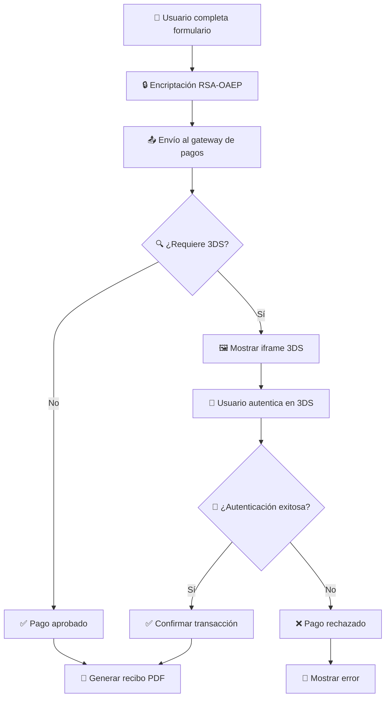
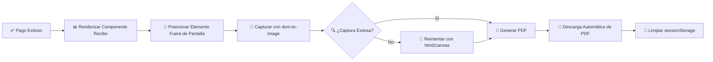

# 🏦 PayEmsula - Plataforma de Pagos

[](https://nextjs.org/)
[](https://www.typescriptlang.org/)
[](https://tailwindcss.com/)
[](https://jestjs.io/)

PayEmsula es una aplicación web moderna desarrollada con Next.js que permite a los usuarios realizar pagos en línea de forma segura y sencilla. La aplicación está diseñada específicamente para clientes de Emsula que desean gestionar y realizar pagos de su línea de crédito con funcionalidades avanzadas como generación automática de recibos PDF y autenticación 3D Secure.

## 📋 Índice

- [✨ Características](#características)
- [🛠️ Tecnologías](#tecnologías)
- [🏗️ Arquitectura de la Aplicación](#arquitectura-de-la-aplicación)
- [🔧 Sistema de Manejo de Errores](#sistema-de-manejo-de-errores)
- [⚡ Sistema Global de Alertas](#sistema-global-de-alertas)
- [📊 Tipos de Datos](#tipos-de-datos)
- [📁 Estructura del Proyecto](#estructura-del-proyecto)
- [🧩 Componentes Principales](#componentes-principales)
- [⚙️ Funciones del Servidor](#funciones-del-servidor)
- [🎣 Hooks Personalizados](#hooks-personalizados)
- [🔧 Utilidades](#utilidades)
- [🔐 Flujo de Autenticación 3DS](#flujo-de-autenticación-3ds)
- [📄 Sistema de Generación de PDFs](#sistema-de-generación-de-pdfs)
- [🚀 Instalación](#instalación)
- [📋 Requisitos](#requisitos)
- [▶️ Ejecutando la Aplicación](#ejecutando-la-aplicación)
- [🧪 Pruebas](#pruebas)
- [👨‍💻 Desarrollo](#desarrollo)
- [🚀 Despliegue](#despliegue)
- [⚡ Optimizaciones y Mejores Prácticas](#optimizaciones-y-mejores-prácticas)
- [📜 Licencia](#licencia)

## ✨ Características

- **🔍 Validación de tarjetas de crédito**: Implementa el algoritmo de Luhn para validar números de tarjetas.
- **🎯 Detección automática del tipo de tarjeta**: Identifica automáticamente si es Visa, Mastercard, American Express, etc.
- **📱 Interfaz responsiva**: Diseño adaptable para dispositivos móviles y de escritorio con animaciones fluidas.
- **✅ Formularios validados**: Validación completa de datos en tiempo real con retroalimentación visual.
- **👤 Información del cliente**: Muestra el resumen de la línea de crédito del cliente y datos de contacto.
- **📈 Proceso de pago multi-paso**: Flujo de pago dividido en pasos intuitivos con barra de progreso animada.
- **🔐 Integración 3DS**: Implementación de Simple Three DS para autenticación segura.
- **📄 Generación de recibos en PDF**: Sistema completo de generación de comprobantes de pago en formato PDF con diseño personalizado.
- **🎨 Animaciones avanzadas**: Interfaz con animaciones suaves usando Framer Motion para mejor experiencia de usuario.
- **✅ Sistema de confirmación**: Modales de confirmación y páginas de éxito/error con feedback visual claro.
- **🔒 Encriptación de datos**: Seguridad avanzada con encriptación RSA-OAEP para datos sensibles de tarjetas.
- **🚨 Sistema global de alertas**: Manejo centralizado de notificaciones con diseño consistente y UX optimizada.
- **❌ Manejo robusto de errores**: Sistema completo de captura, estructuración y presentación de errores.

## 🛠️ Tecnologías

| Tecnología | Versión | Descripción |
|------------|---------|-------------|
|  | **[Next.js 15](https://nextjs.org/)** | Framework React con App Router |
|  | **[TypeScript](https://www.typescriptlang.org/)** | Lenguaje con tipado estático |
|  | **[Tailwind CSS](https://tailwindcss.com/)** | Framework de CSS utility-first |
|  | **[Radix UI](https://www.radix-ui.com/)** | Componentes UI accesibles |
|  | **[Lucide React](https://lucide.dev/)** | Librería de iconos |
|  | **[Motion](https://motion.dev/)** | Animaciones fluidas y transiciones |
|  | **[jsPDF](https://github.com/parallax/jsPDF)** | Generación de documentos PDF |
|  | **[node-forge](https://github.com/digitalbazaar/forge)** | Encriptación RSA-OAEP |
|  | **[Jest](https://jestjs.io/)** | Marco de pruebas |
|  | **Docker** | Containerización |

## Arquitectura de la Aplicación

PayEmsula sigue una arquitectura moderna de Next.js 15 con App Router, implementando un patrón de separación de responsabilidades:

### Flujo de Datos
1. **Captura de Datos**: Los componentes de formulario capturan y validan datos del usuario
2. **Encriptación**: Los datos sensibles se encriptan usando RSA-OAEP antes de enviarse al servidor
3. **Procesamiento 3DS**: Se integra con el gateway de pagos para autenticación 3D Secure
4. **Confirmación**: Se confirma la transacción y se generan los recibos PDF automáticamente

### Patrones de Diseño
- **Custom Hooks**: Para lógica reutilizable (usePaymentForm, usePaymentProcess)
- **Server Actions**: Para operaciones seguras del lado del servidor
- **Component Composition**: Componentes modulares y reutilizables
- **State Management**: Gestión de estado local con React hooks y sessionStorage para persistencia

### 🔒 Seguridad
- **🔐 Encriptación End-to-End**: Datos de tarjetas encriptados con claves públicas RSA
- **🎫 Validación JWT**: Tokens con validación de expiración y margen de seguridad
- **🧹 Sanitización de Datos**: Validación estricta en frontend y backend
- **🛡️ 3D Secure**: Autenticación adicional para transacciones

## 🔧 Sistema de Manejo de Errores

PayEmsula implementa un sistema robusto de manejo de errores que garantiza una experiencia de usuario consistente y facilita el debugging durante el desarrollo.

### 🏗️ Arquitectura del Sistema de Errores

#### ✅ Errores Estructurados
Todos los errores de la API siguen el formato `ResTypeError`:

```typescript
interface ResTypeError {
  title: string;    // Título descriptivo del error
  message: string;  // Mensaje detallado para el usuario
}
```

#### 🔄 Patrón de Respuesta Unificado
Las funciones del servidor retornan tipos union que permiten manejar tanto éxitos como errores:

```typescript
// Antes: Funciones lanzaban excepciones
throw new Error("Algo salió mal")

// Ahora: Funciones retornan tipos union
return Promise<SuccessType | ResTypeError>
```

### 🛠️ Implementación

#### 📡 Funciones del Servidor
- **`postData()`**: Maneja errores de pago y 3DS
- **`getConfirmations()`**: Gestiona errores de confirmación de transacciones
- **`getCenterList()`** y **`getCustomerInfo()`**: Manejan errores de consulta de datos

#### 🔍 Detección de Errores
```typescript
function isErrorResponse(response: unknown): response is ResTypeError {
  return response !== null && 
         typeof response === 'object' && 
         'title' in response && 
         'message' in response;
}
```

#### 🎯 Manejo en Componentes
```typescript
const result = await postData(formData);
if (isErrorResponse(result)) {
  showError(result.title, result.message);
  return;
}
// Continuar con lógica de éxito
```

### ✅ Beneficios del Sistema

| Beneficio | Descripción |
|-----------|-------------|
| **🎯 Consistencia** | Todos los errores siguen el mismo formato |
| **🧪 Testeable** | Errores predecibles facilitan las pruebas |
| **👤 UX Mejorada** | Mensajes de error claros y accionables |
| **🐛 Debugging** | Trazabilidad completa de errores |
| **🔧 Mantenible** | Lógica centralizada de manejo de errores |

## ⚡ Sistema Global de Alertas

### 🎨 Características del Sistema
- **🌍 Estado Global**: Gestión centralizada con React Context
- **🎭 Múltiples Tipos**: Error, Éxito, Advertencia, Información
- **⏰ Auto-cierre**: Configuración flexible de duración
- **⌨️ Accesibilidad**: Cierre con tecla ESC
- **📱 Responsivo**: Diseño adaptable a dispositivos móviles

### 🧩 Componentes

#### 🎮 AlertProvider
```typescript
// Contexto global para alertas
<AlertProvider>
  <App />
</AlertProvider>
```

#### 🚨 GlobalAlert
```typescript
// Componente visual de alertas
<GlobalAlert duration={5000} />
```

#### 🎣 useAlert Hook
```typescript
const { showError, showSuccess, showWarning, showInfo } = useAlert();

// Uso en componentes
showError("Error de conexión", "No se pudo conectar al servidor");
showSuccess("¡Éxito!", "Pago procesado correctamente");
```

### 🎨 Tipos de Alertas

| Tipo | Icono | Color | Uso |
|------|-------|-------|-----|
| **Error** | 🚫 AlertCircle | Rojo | Errores críticos |
| **Success** | ✅ CheckCircle | Verde | Operaciones exitosas |
| **Warning** | ⚠️ AlertTriangle | Amarillo | Advertencias |
| **Info** | ℹ️ Info | Azul | Información general |

## 📊 Tipos de Datos

La aplicación utiliza TypeScript con interfaces bien definidas para garantizar la seguridad de tipos:

### 🏗️ Interfaces Principales

#### 👤 `DataCardUser`
```typescript
interface DataCardUser {
  mail: string;
  name: string;
  email: string;
  phone: string;
}
```
**Propósito**: Datos básicos del usuario para el formulario de pago.

#### 💳 `CardData`
```typescript
interface CardData {
  name: string;           // Nombre del titular
  phone: string;          // Teléfono de contacto
  cardNumber: string;     // Número de tarjeta
  expiryDate: string;     // Fecha de expiración (MM/YY)
  cvv: string;           // Código de seguridad
  paymentAmount: number;  // Monto a pagar
  customerId: number;     // ID del cliente
}
```
**Propósito**: Datos completos de la tarjeta para procesamiento de pago.

#### 🧾 `BillData` 
```typescript
interface BillData {
  name: string;           // Nombre del cliente
  amountPaid: number;     // Monto pagado
  verification: string;   // Código de verificación
  lastFourDigits: string; // Últimos 4 dígitos de la tarjeta
  reference: string;      // Referencia de la transacción
  cardBrand: string;      // Marca de la tarjeta (Visa, MC, etc.)
  phoneNumber: string;    // Teléfono del cliente
}
```
**Propósito**: Datos utilizados para generar el recibo PDF del cliente.

#### ✅ `ResType`
```typescript
interface ResType {
  authorizationCode: string;      // Código de autorización
  transactionIdentifier: string;  // ID de transacción
  totalAmount: number;           // Monto total
  cardBrand: string;             // Marca de tarjeta
  responseMessage: string;       // Mensaje de respuesta
  orderIdentifier: string;       // ID de la orden
}
```
**Propósito**: Respuesta de la transacción procesada por el gateway de pagos.

#### 🏢 `DataCustomer`
```typescript
type DataCustomer = {
  id: number;              // ID único del cliente
  name: string;            // Nombre completo
  phoneNumber: string;     // Teléfono de contacto
  businessName: string;    // Nombre del negocio
  totalDebt: number;       // Deuda total
  creditLimit: number;     // Límite de crédito
  availableCredit: number; // Crédito disponible
  lastPaymentDate: string; // Fecha último pago
  paymentStatus: string;   // Estado de pago
}
```
**Propósito**: Información completa del cliente y su línea de crédito.

#### 🔐 `ResType3DS`
```typescript
interface ResType3DS {
  requestId: string;    // ID de la solicitud 3DS
  html: string;        // HTML del formulario 3DS
  finalLinks: string[]; // URLs de finalización
}
```
**Propósito**: Respuesta del sistema 3D Secure para autenticación.

#### ❌ `ResTypeError`
```typescript
interface ResTypeError {
  title: string;    // Título descriptivo del error
  message: string;  // Mensaje detallado para mostrar al usuario
}
```
**Propósito**: Formato estándar para todos los errores de la aplicación.

## 📁 Estructura del Proyecto

```
📦 pay-emsula/
├── 📁 src/
│   ├── 📁 app/                    # Next.js App Router
│   │   ├── 📄 layout.tsx          # Layout principal con AlertProvider
│   │   ├── 📄 page.tsx            # Página de inicio
│   │   ├── 📁 pago/               # Página de pagos
│   │   └── 📁 api/                # API Routes
│   │       └── 📁 back/           # Endpoint de confirmación
│   ├── 📁 components/             # Componentes React
│   │   ├── 📄 global-alert.tsx    # 🚨 Sistema global de alertas
│   │   ├── 📄 payment-form.tsx    # 💳 Formulario principal de pago
│   │   ├── 📄 simple-three-ds-modal.tsx # 🔐 Modal de autenticación 3DS
│   │   ├── 📁 payment-form/       # Subcomponentes del formulario
│   │   │   ├── 📄 personal-info-step.tsx
│   │   │   ├── 📄 card-details-step.tsx
│   │   │   ├── 📄 form-actions.tsx
│   │   │   └── 📄 form-progress.tsx
│   │   └── 📁 ui/                 # Componentes UI base
│   ├── 📁 hooks/                  # Custom Hooks
│   │   ├── 📄 useAlert.ts         # 🎣 Hook de alertas globales
│   │   ├── 📄 usePaymentForm.ts   # 🎣 Lógica del formulario de pago
│   │   └── 📄 usePaymentProcess.ts # 🎣 Proceso de pago y 3DS
│   ├── 📁 providers/              # React Contexts
│   │   └── 📄 alert-provider.tsx  # 🌍 Proveedor global de alertas
│   ├── 📁 server/                 # Server Functions
│   │   ├── 📄 postData.ts         # ⚙️ Funciones de envío de datos
│   │   └── 📄 getData.ts          # ⚙️ Funciones de consulta de datos
│   ├── 📁 lib/                    # Utilidades
│   │   ├── 📄 card-utils.ts       # 💳 Validación de tarjetas
│   │   ├── 📄 iframe-utils.ts     # 🖼️ Manejo de iframes 3DS
│   │   └── 📄 utils.ts            # 🔧 Utilidades generales
│   ├── 📁 types/                  # Definiciones TypeScript
│   │   └── 📄 types.ts            # 📊 Interfaces y tipos
│   └── 📁 __tests__/              # 🧪 Suite de pruebas
│       ├── 📁 components/         # Tests de componentes
│       ├── 📁 hooks/              # Tests de hooks
│       ├── 📁 providers/          # Tests de providers
│       ├── 📁 server/             # Tests de funciones servidor
│       └── 📁 lib/                # Tests de utilidades
├── 📁 public/                     # Archivos estáticos
│   ├── 🖼️ logo.svg               # Logo de la aplicación
│   └── 🖼️ *.png/*.jpg            # Imágenes de productos
├── ⚙️ package.json               # Dependencias del proyecto
├── 📝 README-ES.md               # Documentación en español
├── 🐳 Dockerfile                 # Configuración Docker
├── ⚡ next.config.ts            # Configuración Next.js
├── 🎨 tailwind.config.ts        # Configuración Tailwind
├── 🧪 jest.config.ts            # Configuración Jest
└── 📘 tsconfig.json             # Configuración TypeScript
```

### 📋 Descripción de Directorios

| Directorio | Propósito | Características |
|------------|-----------|-----------------|
| **📁 `src/app/`** | Next.js App Router | Rutas y layouts de la aplicación |
| **📁 `src/components/`** | Componentes React | UI reutilizable y específica |
| **📁 `src/hooks/`** | Custom Hooks | Lógica reutilizable de React |
| **📁 `src/providers/`** | Context Providers | Estado global de la aplicación |
| **📁 `src/server/`** | Server Functions | Lógica del lado del servidor |
| **📁 `src/lib/`** | Utilidades | Funciones auxiliares |
| **📁 `src/types/`** | Tipos TypeScript | Definiciones de interfaces |
| **📁 `src/__tests__/`** | Pruebas | Suite completa de testing |

## 🧩 Componentes Principales

### 🎯 Componentes de UI Principal

#### 💳 `PaymentForm`
- **Propósito**: Formulario principal de captura de datos de pago
- **Características**:
  - ✅ Validación en tiempo real
  - 📱 Diseño responsivo
  - 🎨 Animaciones fluidas
  - 📊 Barra de progreso animada

#### 🔐 `SimpleThreeDSModal`  
- **Propósito**: Modal para autenticación 3D Secure
- **Características**:
  - 🖼️ Iframe seguro para 3DS
  - ⏱️ Manejo de timeouts
  - 🔄 Estados de carga y error
  - 📱 Diseño responsivo

#### 🚨 `GlobalAlert`
- **Propósito**: Sistema centralizado de notificaciones
- **Características**:
  - 🎭 4 tipos de alertas (Error, Éxito, Advertencia, Info)
  - ⏰ Auto-cierre configurable
  - ⌨️ Accesibilidad (ESC para cerrar)
  - 🎨 Diseño consistente con iconos

### 🎮 Componentes del Formulario

#### 👤 `PersonalInfoStep`
```typescript
// Captura de información personal
- Nombre completo
- Teléfono de contacto  
- Validación en tiempo real
```

#### 💳 `CardDetailsStep`
```typescript
// Detalles de la tarjeta
- Número de tarjeta con detección automática de tipo
- Fecha de expiración con formato automático
- CVV con validación específica por tipo
- Monto a pagar con formato de moneda
```

#### 🎯 `FormActions`
```typescript
// Acciones del formulario
- Botones de navegación (Anterior/Siguiente)
- Botón de procesamiento de pago
- Estados de carga y deshabilitado
```

#### 📊 `FormProgress`
```typescript
// Barra de progreso
- Indicador visual de paso actual
- Transiciones animadas entre pasos
- Navegación clickeable entre pasos completados
```

## ⚙️ Funciones del Servidor

### 📤 Funciones de Envío (`postData.ts`)

#### 🔒 `postData(cardData: CardData)`
```typescript
// Procesa datos de pago con encriptación RSA-OAEP
✅ Retorna: ResType3DS | ResTypeError
🔐 Encripta datos sensibles de tarjeta
⚡ Manejo robusto de errores
🎯 Validación de respuestas estructuradas
```

#### 🔑 `getPublicKey()`
```typescript
// Obtiene clave pública para encriptación
✅ Manejo de errores HTTP
🔒 Validación de clave RSA
⚡ Timeout configurado
```

### 📥 Funciones de Consulta (`getData.ts`)

#### ✅ `getConfirmations(requestId: string)`
```typescript
// Confirma estado de transacciones 3DS
✅ Retorna: ResType | ResTypeError
🔍 Validación de requestId
⏱️ Polling de estado de transacción
🎯 Manejo consistente de errores
```

#### 🏢 `getCenterList()`
```typescript
// Lista centros de distribución
✅ Retorna: CenterList[] | ResTypeError
📋 Cache de resultados
🔍 Filtrado y búsqueda
⚡ Optimización de red
```

#### 👤 `getCustomerInfo(customerId: number)`
```typescript
// Información detallada del cliente
✅ Retorna: DataCustomer | ResTypeError
🔍 Validación de ID de cliente
💰 Datos de crédito y deuda
📊 Historial de pagos
```

## 🎣 Hooks Personalizados

### 🚨 `useAlert`
```typescript
const { showError, showSuccess, showWarning, showInfo, closeAlert } = useAlert()

// Características:
✅ Estado global compartido
🎨 Tipos predefinidos de alertas
⏰ Auto-cierre configurable
🎯 API simple y consistente
```

### 💳 `usePaymentForm`
```typescript
const { 
  formData, 
  errors, 
  currentStep, 
  updateField, 
  nextStep, 
  prevStep,
  validateStep 
} = usePaymentForm()

// Características:
📝 Gestión completa del formulario
✅ Validación por pasos
🎯 Navegación entre pasos
💾 Persistencia en sessionStorage
🔄 Sincronización de estado
```

### 💰 `usePaymentProcess`
```typescript
const {
  isWaiting,
  showThreeDS,
  paying,
  htmlResponse,
  startPayment,
  closeModal,
  handleThreeDSSuccess
} = usePaymentProcess()

// Características:
🔐 Integración completa con 3DS
⚡ Estados de carga optimizados
❌ Manejo robusto de errores
🎯 Flujo de pago completo
📱 UX responsive
```

## 🔧 Utilidades

### 💳 `card-utils.ts`

#### 🔍 Validación de Tarjetas
```typescript
// Validación Luhn para números de tarjeta
validateCardNumber(cardNumber: string): boolean

// Detección automática del tipo de tarjeta
getCardType(cardNumber: string): 'visa' | 'mastercard' | 'amex' | 'unknown'

// Formateo visual de números
formatCardNumber(cardNumber: string): string

// Validación de fecha de expiración
validateExpiryDate(expiryDate: string): boolean

// Validación de CVV específica por tipo
validateCVV(cvv: string, cardType: string): boolean
```

### 🖼️ `iframe-utils.ts`

#### 🔐 Manejo de 3DS
```typescript
// Carga segura de HTML en iframe
loadHTMLIntoIframe(iframeId: string, htmlContent: string): void

// Configuración de iframe para 3DS
setupSecureIframe(iframe: HTMLIFrameElement): void

// Detección de eventos de finalización 3DS
listen3DSCompletion(callback: Function): void
```

### 🎨 `animation-variants.ts`

#### ✨ Variantes de Animación
```typescript
// Animaciones de entrada/salida para pasos del formulario
export const stepVariants = {
  enter: { opacity: 1, x: 0, transition: { duration: 0.3 } },
  exit: { opacity: 0, x: -20, transition: { duration: 0.2 } },
  initial: { opacity: 0, x: 20 }
}

// Animaciones para alertas
export const alertVariants = {
  initial: { opacity: 0, y: -50, scale: 0.95 },
  animate: { opacity: 1, y: 0, scale: 1 },
  exit: { opacity: 0, y: -50, scale: 0.95 }
}
```

## 🔐 Flujo de Autenticación 3DS

### 🔄 Proceso Completo



### 🛡️ Seguridad Implementada

| Característica | Implementación | Beneficio |
|----------------|----------------|-----------|
| **🔒 Encriptación RSA-OAEP** | Clave pública 2048-bit | Protección de datos sensibles |
| **🎯 Validación JWT** | Verificación con margen de 2min | Prevención de tokens expirados |
| **🧹 Sanitización** | Validación estricta de entrada | Prevención de inyecciones |
| **🔐 3D Secure** | Iframe aislado | Autenticación adicional |
| **📱 HTTPS** | Certificados válidos | Comunicación segura |

## 📄 Sistema de Generación de PDFs

### 🎨 Características del PDF

#### 📋 Estructura del Recibo
```typescript
✅ Header con logo e información de la empresa (Embotelladora De Sula S.A.)
📊 Grilla de detalles de transacción (Fecha, Referencia, Verificación, Tarjeta)
💰 Monto pagado en Lempiras hondureñas (L.)
🔢 Códigos únicos de verificación y referencia
📅 Timestamp de la transacción
🖊️ Nombre del cliente y teléfono formateado
💳 Últimos 4 dígitos de la tarjeta (enmascarado por seguridad)
🎨 Diseño profesional con colores corporativos de la empresa
```

#### 🛠️ Tecnologías Utilizadas
- **jsPDF**: Generación de documentos PDF con dimensiones personalizadas
- **dom-to-image**: Método principal para conversión HTML-a-imagen
- **html2canvas**: Método de respaldo para captura confiable de imágenes
- **React**: Estructura de recibo basada en componentes
- **Tailwind CSS**: Estilizado y diseño responsivo

#### 🔧 Implementación Técnica

**Soluciones Clave Implementadas:**
- **Gestión de Visibilidad**: Elemento posicionado fuera de pantalla pero completamente renderizado para captura
- **Optimización de Imágenes**: Etiquetas `` estándar en lugar de `<Image>` de Next.js para compatibilidad
- **Métodos Duales de Captura**: dom-to-image principal con respaldo de html2canvas
- **Dimensiones PDF Personalizadas**: 103.19mm x 239.45mm (formato de recibo)
- **Aplicación de Estilos**: Estilizado CSS directo para renderizado consistente
- **Manejo de Errores**: Captura integral de errores y retroalimentación al usuario

### 💾 Flujo de Generación



#### � Problemas Comunes Resueltos
- **PDF en Blanco**: Solucionado asegurando visibilidad del elemento durante captura
- **Carga de Imágenes**: Implementada verificación adecuada de carga de imágenes
- **Compatibilidad CSS**: Resuelto renderizado de Tailwind CSS en contexto PDF
- **Gestión de Memoria**: Limpieza adecuada de recursos generados
- **Fragmentación de Texto**: Solucionado división de texto DOM en tests usando matchers flexibles

#### 🧪 Cobertura de Testing
El sistema de generación de PDF incluye pruebas unitarias integrales que cubren:
- ✅ Renderizado de componentes y visualización de datos
- ✅ Funcionalidad de generación PDF con dependencias mockeadas
- ✅ Limpieza de sessionStorage después de generación
- ✅ Manejo de errores para generaciones fallidas
- ✅ Formateo de datos (números de teléfono, moneda, fechas)
- ✅ Gestión de estado de UI (visibilidad de botones)

## 🚀 Instalación

### 📋 Requisitos Previos

| Herramienta | Versión Mínima | Propósito |
|-------------|----------------|-----------|
| **Node.js** | 18.17.0+ | Runtime de JavaScript |
| **npm** | 9.0.0+ | Gestor de paquetes |
| **Git** | 2.34.0+ | Control de versiones |

### ⚡ Instalación Rápida

```bash
# 1. Clonar el repositorio
git clone https://github.com/tu-usuario/pay-emsula.git
cd pay-emsula

# 2. Instalar dependencias
npm install

# 3. Configurar variables de entorno
cp .env.example .env.local
# Editar .env.local con tus valores

# 4. Ejecutar en modo desarrollo
npm run dev

# 5. Abrir en navegador
# Visita: http://localhost:3000
```

### 🔧 Variables de Entorno

```bash
# .env.local
API_BASE_URL=https://api.tu-servidor.com
API_KEY=tu-clave-api-secreta
NEXT_PUBLIC_APP_URL=http://localhost:3000
USE_LUHN_VALIDATION=true
```

> **💳 Validación Luhn**: La variable `USE_LUHN_VALIDATION` habilita la doble validación del algoritmo de Luhn en el backend. Cuando está en `true`, el servidor realizará una validación adicional del número de tarjeta usando el algoritmo de Luhn, proporcionando una capa extra de seguridad en el procesamiento de pagos.

## ▶️ Ejecutando la Aplicación

### 🛠️ Comandos Disponibles

```bash
# 🚀 Desarrollo
npm run dev          # Servidor de desarrollo con hot-reload

# 🏗️ Construcción
npm run build        # Construcción optimizada para producción
npm run start        # Servidor de producción

# 🧪 Testing
npm test             # Ejecutar todos los tests
npm run test:watch   # Tests en modo observación
npm run test:coverage # Cobertura de tests

# 🔍 Linting y Formato
npm run lint         # Verificar código con ESLint
npm run lint:fix     # Corregir errores automáticamente
```

### 🐳 Docker

```bash
# Construir imagen
docker build -t pay-emsula .

# Ejecutar contenedor
docker run -p 3000:3000 pay-emsula
```

## 🧪 Pruebas

### 📊 Cobertura de Testing

| Tipo | Archivos | Tests | Cobertura |
|------|----------|-------|-----------|
| **🧩 Componentes** | 5 | 41 | 95%+ |
| **🎣 Hooks** | 2 | 16 | 90%+ |
| **⚙️ Funciones del Servidor** | 1 | 8 | 85%+ |
| **🔧 Utilidades** | 1 | 12 | 100% |
| **🌍 Proveedores** | 1 | 7 | 95%+ |
| **📄 Páginas** | 1 | 1 | 80%+ |

**📈 Total: 85 tests pasando (100%)**

### 🎯 Tipos de Tests

#### ✅ Tests Unitarios

```bash
# Componentes individuales
src/__tests__/components/
├── personal-info-step.test.tsx
├── card-details-step.test.tsx
├── form-actions.test.tsx
├── global-alert.test.tsx
└── customerBill.test.tsx         # 📄 Componente de recibo PDF (13 tests)

# Hooks personalizados
src/__tests__/hooks/
├── usePaymentForm.test.tsx
└── usePaymentProcess.test.tsx

# Funciones utilitarias
src/__tests__/lib/
└── card-utils.test.ts
```

#### 🔗 Tests de Integración

```bash
# Funciones del servidor
src/__tests__/server/
└── postData.test.ts

# Proveedores y contextos
src/__tests__/providers/
└── alert-provider.test.tsx
```

#### 🌐 Tests E2E

```bash
# Páginas completas
src/__tests__/app/
└── page.test.tsx
```

### 🚀 Ejecutando Tests

```bash
# Todos los tests
npm test

# Tests específicos
npm test -- card-utils.test.ts

# Con cobertura
npm run test:coverage

# Modo observación
npm run test:watch
```

## 👨‍💻 Desarrollo

### 🛠️ Configuración del Entorno de Desarrollo

#### 📋 Herramientas Recomendadas

| Herramienta | Propósito | Configuración |
|-------------|-----------|---------------|
| **VS Code** | Editor principal | Extensiones ESLint, Prettier, TypeScript |
| **Chrome DevTools** | Debugging | React Developer Tools |
| **Git** | Control de versiones | Hooks de pre-commit configurados |
| **Postman** | Testing de APIs | Colecciones de endpoints |

#### 🔧 Extensiones de VS Code
```json
{
  "recommendations": [
    "bradlc.vscode-tailwindcss",
    "esbenp.prettier-vscode", 
    "dbaeumer.vscode-eslint",
    "ms-vscode.vscode-typescript-next",
    "formulahendry.auto-rename-tag"
  ]
}
```

### 📝 Estándares de Código

#### 🎨 Estilo y Formato
- **Prettier**: Formato automático de código
- **ESLint**: Linting con reglas estrictas
- **TypeScript**: Tipado estático obligatorio
- **Tailwind CSS**: Clases utilitarias para estilos

#### 📂 Convenciones de Nomenclatura
```typescript
// Archivos
kebab-case.tsx           // Componentes
camelCase.ts            // Utilidades
PascalCase.tsx          // Componentes principales

// Variables y funciones
const myVariable = ''    // camelCase
const MyComponent = ()   // PascalCase
const MY_CONSTANT = ''   // UPPER_SNAKE_CASE

// Interfaces y tipos
interface MyInterface {} // PascalCase con 'I' opcional
type MyType = string    // PascalCase
```

#### 🏗️ Estructura de Componentes
```typescript
// Template recomendado para componentes
interface ComponentProps {
  // Props tipadas
}

export function MyComponent({ prop1, prop2 }: ComponentProps) {
  // 1. Hooks de estado
  // 2. Hooks personalizados
  // 3. Efectos
  // 4. Handlers
  // 5. Render
}
```

### 🔄 Flujo de Trabajo Git

```bash
# 1. Crear rama para feature
git checkout -b feature/nueva-funcionalidad

# 2. Hacer commits descriptivos
git commit -m "feat: agregar validación de tarjetas"
git commit -m "fix: corregir formato de fecha"
git commit -m "docs: actualizar README"

# 3. Ejecutar tests antes del push
npm test

# 4. Push y crear Pull Request
git push origin feature/nueva-funcionalidad
```

#### 📋 Tipos de Commits (Conventional Commits)
- **feat**: Nueva funcionalidad
- **fix**: Corrección de bugs
- **docs**: Documentación
- **style**: Formato de código
- **refactor**: Refactorización
- **test**: Agregar/modificar tests
- **chore**: Tareas de mantenimiento

## 🚀 Despliegue

### 🌐 Opciones de Despliegue

#### ⚡ Vercel (Recomendado)
```bash
# 1. Instalar Vercel CLI
npm i -g vercel

# 2. Login y configuración
vercel login
vercel

# 3. Configurar variables de entorno en dashboard
# 4. Deploy automático con cada push a main
```

#### 🐳 Docker
```dockerfile
# Dockerfile optimizado para producción
FROM node:18-alpine AS base
WORKDIR /app
COPY package*.json ./
RUN npm ci --only=production

FROM base AS build
RUN npm ci
COPY . .
RUN npm run build

FROM base AS runtime
COPY --from=build /app/.next ./.next
COPY --from=build /app/public ./public
EXPOSE 3000
CMD ["npm", "start"]
```

#### ☁️ AWS/Azure/GCP
```bash
# Ejemplo con AWS Amplify
npm install -g @aws-amplify/cli
amplify init
amplify add hosting
amplify publish
```

### 🔧 Configuración de Producción

#### 🛡️ Variables de Entorno de Producción
```bash
# .env.production
NODE_ENV=production
API_BASE_URL=https://api.produccion.com
API_KEY=clave-produccion-segura
NEXT_PUBLIC_APP_URL=https://pay-emsula.com
USE_LUHN_VALIDATION=true
```

#### ⚡ Optimizaciones
```javascript
// next.config.ts
const nextConfig = {
  experimental: {
    optimizeCss: true,
    optimizeImages: true,
  },
  compiler: {
    removeConsole: process.env.NODE_ENV === 'production',
  },
  images: {
    domains: ['api.produccion.com'],
    formats: ['image/webp', 'image/avif'],
  }
}
```

## ⚡ Optimizaciones y Mejores Prácticas

### 🚀 Performance

#### 📦 Bundle Optimization
```javascript
// Lazy loading de componentes pesados
const HeavyComponent = lazy(() => import('./HeavyComponent'))

// Code splitting por rutas
const PaymentPage = lazy(() => import('../pages/PaymentPage'))

// Preloading de recursos críticos
<link rel="preload" href="/api/public-key" as="fetch" />
```

#### 🖼️ Optimización de Imágenes
```jsx
// Next.js Image con optimización automática
import Image from 'next/image'

<Image
  src="/logo.svg"
  alt="Logo"
  width={200}
  height={100}
  priority={true} // Para above-the-fold content
  placeholder="blur"
/>
```

### 🛡️ Seguridad

#### 🔒 Headers de Seguridad
```javascript
// next.config.ts
const securityHeaders = [
  {
    key: 'X-DNS-Prefetch-Control',
    value: 'on'
  },
  {
    key: 'Strict-Transport-Security',
    value: 'max-age=63072000; includeSubDomains; preload'
  },
  {
    key: 'X-Frame-Options',
    value: 'SAMEORIGIN'
  },
  {
    key: 'X-Content-Type-Options',
    value: 'nosniff'
  }
]
```

#### 🔍 Validación de Datos
```typescript
// Validación estricta en frontend y backend
const validateCardData = (data: CardData): string[] => {
  const errors: string[] = []
  
  if (!isValidCardNumber(data.cardNumber)) {
    errors.push('Número de tarjeta inválido')
  }
  
  if (!isValidExpiryDate(data.expiryDate)) {
    errors.push('Fecha de expiración inválida')
  }
  
  return errors
}
```

### 📱 Accesibilidad

#### ♿ WCAG 2.1 Compliance
```jsx
// Etiquetas semánticas y ARIA
<form role="form" aria-labelledby="payment-form-title">
  <h2 id="payment-form-title">Formulario de Pago</h2>
  
  <input 
    aria-describedby="card-number-help"
    aria-invalid={hasError}
    aria-required="true"
  />
  
  <div id="card-number-help" className="sr-only">
    Ingrese los 16 dígitos de su tarjeta
  </div>
</form>
```

#### ⌨️ Navegación por Teclado
```typescript
// Manejo de teclas para modales
useEffect(() => {
  const handleKeyDown = (event: KeyboardEvent) => {
    if (event.key === 'Escape') {
      closeModal()
    }
    if (event.key === 'Tab') {
      // Trap focus dentro del modal
      trapFocus(event)
    }
  }
  
  document.addEventListener('keydown', handleKeyDown)
  return () => document.removeEventListener('keydown', handleKeyDown)
}, [])
```

### 📊 Monitoreo y Analytics

#### 📈 Performance Monitoring
```typescript
// Web Vitals tracking
import { getCLS, getFID, getFCP, getLCP, getTTFB } from 'web-vitals'

getCLS(console.log)
getFID(console.log)
getFCP(console.log)
getLCP(console.log)
getTTFB(console.log)
```

#### 🔍 Error Tracking
```typescript
// Error boundary para captura de errores
class ErrorBoundary extends React.Component {
  static getDerivedStateFromError(error: Error) {
    return { hasError: true }
  }

  componentDidCatch(error: Error, errorInfo: ErrorInfo) {
    console.error('Error capturado:', error, errorInfo)
    // Enviar a servicio de monitoreo (Sentry, LogRocket, etc.)
  }
}
```

## 📜 Licencia

```
MIT License

Copyright (c) 2024 PayEmsula

Permission is hereby granted, free of charge, to any person obtaining a copy
of this software and associated documentation files (the "Software"), to deal
in the Software without restriction, including without limitation the rights
to use, copy, modify, merge, publish, distribute, sublicense, and/or sell
copies of the Software, and to permit persons to whom the Software is
furnished to do so, subject to the following conditions:

The above copyright notice and this permission notice shall be included in all
copies or substantial portions of the Software.

THE SOFTWARE IS PROVIDED "AS IS", WITHOUT WARRANTY OF ANY KIND, EXPRESS OR
IMPLIED, INCLUDING BUT NOT LIMITED TO THE WARRANTIES OF MERCHANTABILITY,
FITNESS FOR A PARTICULAR PURPOSE AND NONINFRINGEMENT. IN NO EVENT SHALL THE
AUTHORS OR COPYRIGHT HOLDERS BE LIABLE FOR ANY CLAIM, DAMAGES OR OTHER
LIABILITY, WHETHER IN AN ACTION OF CONTRACT, TORT OR OTHERWISE, ARISING FROM,
OUT OF OR IN CONNECTION WITH THE SOFTWARE OR THE USE OR OTHER DEALINGS IN THE
SOFTWARE.
```

---

<div align="center">

### 🚀 **PayEmsula - Pagos Seguros y Modernos**

[](https://github.com/tu-usuario/pay-emsula)
[](https://nextjs.org)
[](https://typescriptlang.org)

**[📚 Documentación](README-ES.md) • [🐛 Reportar Bug](https://github.com/tu-usuario/pay-emsula/issues) • [💡 Solicitar Feature](https://github.com/tu-usuario/pay-emsula/issues)**

</div>
├── app/                   # Directorio de la aplicación Next.js
│   ├── layout.tsx         # Diseño raíz de la aplicación
│   ├── page.tsx           # Página principal
│   ├── api/               # Rutas API
│   │   └── back/          # API para comunicación con backend
│   │       └── route.ts   # Manejo de peticiones GET/POST
│   ├── pago/              # Ruta de página de pago
│   │   └── page.tsx       # Página de proceso de pago
│   └── globals.css        # Estilos globales
├── components/            # Componentes reutilizables
│   ├── client-info-card.tsx     # Tarjeta de información del cliente
│   ├── payment-form.tsx         # Formulario de pago principal
│   ├── confirmations.tsx        # Componente de confirmación de pago
│   ├── customerBill.tsx         # Generador de recibos PDF
│   ├── phone-input.tsx          # Input de teléfono con validación
│   ├── modalWait.tsx            # Modal de espera con animaciones
│   ├── isYouWant.tsx           # Modal de confirmación genérico
│   ├── simple-three-ds-modal.tsx # Modal para autenticación 3DS
│   ├── payment-form/        # Subcomponentes del formulario de pago
│   │   ├── card-details-step.tsx  # Paso de detalles de tarjeta
│   │   ├── personal-info-step.tsx # Paso de información personal
│   │   ├── form-actions.tsx      # Acciones del formulario
│   │   └── form-progress.tsx     # Barra de progreso del formulario
│   └── ui/                # Componentes de UI básicos
│       ├── button.tsx     # Componente de botón
│       ├── card.tsx       # Componente de tarjeta
│       ├── dialog.tsx     # Modal y diálogos
│       ├── input.tsx      # Componente de entrada
│       └── label.tsx      # Componente de etiqueta
├── hooks/                 # Hooks personalizados
│   ├── usePaymentForm.ts  # Hook para manejo del formulario de pago
│   └── usePaymentProcess.ts # Hook para proceso de pago y 3DS
├── lib/                   # Utilidades y funciones auxiliares
│   ├── card-utils.ts      # Utilidades para validación de tarjetas
│   ├── iframe-utils.ts    # Utilidades para manejo de iframes
│   ├── animation-variants.ts # Variantes de animación para Framer Motion
│   └── utils.ts           # Utilidades generales
├── server/                # Funciones del lado del servidor
│   ├── getData.ts         # Funciones para obtener datos (GET)
│   └── postData.ts        # Funciones para enviar datos (POST)
├── types/                 # Definiciones de tipos TypeScript
│   └── types.ts           # Interfaces y tipos principales
└── __tests__/             # Tests de la aplicación
    ├── app/               # Tests de páginas
    ├── components/        # Tests de componentes
    ├── hooks/             # Tests de hooks
    └── lib/               # Tests de utilidades
```

## Componentes Principales

### 1. PaymentForm

Componente principal que implementa el formulario de pago con:
- Estructura de multi-pasos para mejorar la experiencia de usuario
- Validación del formulario usando hooks personalizados
- Gestión de estados entre pasos
- Animaciones fluidas con Framer Motion

#### Subcomponentes:

- **PersonalInfoStep**: Recoge información personal del usuario
- **CardDetailsStep**: Maneja la información de la tarjeta con:
  - Validación del número de tarjeta en tiempo real
  - Detección automática del tipo de tarjeta
  - Validación de fecha de expiración y CVV
- **FormActions**: Botones de navegación entre pasos con animaciones
- **FormProgress**: Indicador visual del progreso del formulario

### 2. ClientInfoCard

Componente que muestra la información del cliente:
- Nombre del cliente y comercio
- Estado de la línea de crédito
- Saldo disponible y previo
- Cantidad a pagar
- Saldo restante

### 3. CustomerBill

Componente avanzado para la generación de recibos en PDF:
- **Generación dinámica**: Crea un recibo personalizado con los datos de la transacción
- **Captura DOM a imagen**: Utiliza `dom-to-image` para convertir el componente HTML a imagen
- **Exportación PDF**: Convierte la imagen a PDF usando `jsPDF` con dimensiones optimizadas
- **Diseño responsivo**: Layout adaptado específicamente para impresión
- **Datos incluidos**:
  - Información de la empresa (Embotelladora De Sula S.A.)
  - Detalles de la transacción (fecha, referencia, verificación)
  - Información del cliente (nombre, teléfono)
  - Monto pagado y últimos 4 dígitos de la tarjeta

### 4. SimpleThreeDsModal

Componente para la autenticación 3DS que:
- Muestra un modal con el iframe de autenticación
- Maneja la comunicación entre la aplicación y el proveedor 3DS
- Procesa la respuesta de autenticación
- Gestiona estados de éxito/fallo

### 5. ConfirmationModal (isYouWant)

Modal genérico de confirmación con:
- Props configurables para título, mensaje y botones
- Animaciones de entrada y salida
- Manejo de teclas (ESC para cerrar)
- Prevención de scroll del body cuando está abierto

### 6. ModalWait

Modal de espera con animaciones:
- Logo animado con rotación 3D
- Gradientes de color personalizados
- Texto con efecto de pulso
- Fondo con efecto blur

### 7. PhoneInput

Componente especializado para capturar datos del cliente:
- Selector de centro de distribución
- Validación de número de teléfono
- Integración con API para obtener información del cliente
- Estados de carga y error

### 8. Confirmations

Componente que maneja las páginas de confirmación:
- Estados de éxito y error
- Integración con el generador de recibos PDF
- Recuperación de datos desde sessionStorage
- Botones de acción (volver al inicio, reintentar)

### 9. Componentes UI

Set de componentes básicos para construir la interfaz:
- **Button**: Botón personalizable con diferentes variantes y tamaños
- **Card**: Contenedor tipo tarjeta con header, content y footer
- **Input**: Campo de entrada personalizado con validación
- **Label**: Etiqueta para campos de formulario
- **Dialog**: Componente modal para diálogos

## Funciones del Servidor

### getData.ts

#### `getConfirmations(requestId: string): Promise<number | ResType>`
Función que confirma un pago mediante el API y actualiza el estado de la transacción. Retorna los datos completos de la transacción incluyendo código de autorización, identificador de transacción, monto total, marca de tarjeta y mensaje de respuesta para la generación automática de recibos PDF.

#### `validateToken(token: string): Promise<boolean>`
Verifica si un token JWT es válido y no ha expirado. Incluye validación de tiempo de vida con margen de seguridad de 2 minutos.

#### `getCenterList(): Promise<CenterList[]>`
Obtiene la lista de centros de distribución disponibles desde el API. Incluye manejo de errores y logging.

#### `getCustomerInfo(telephone: number, centerId: number): Promise<DataCustomer>`
Obtiene la información detallada de un cliente específico basada en su número de teléfono y centro de distribución.

### postData.ts

#### `postData(data: CardData): Promise<{requestId: string, html: string}>`
Función principal para procesar datos de pago:
- Obtiene la clave pública del servidor
- Encripta los datos sensibles de la tarjeta usando RSA-OAEP
- Envía la información al gateway de pagos
- Retorna el ID de la solicitud y el HTML para autenticación 3DS

#### `base64ToPem(base64Key: string): string`
Convierte una clave en formato base64 a formato PEM para su uso en encriptación.

#### `encryptWithPublicKey(publicKeyBase64: string, textToEncrypt: unknown): string`
Encripta datos sensibles usando clave pública RSA-OAEP con hash SHA-256.

#### `getPublicKey(): Promise<string>`
Obtiene la clave pública del servidor de pagos para encriptar datos sensibles.

## Hooks Personalizados

### usePaymentForm.ts

Hook personalizado para manejar el estado y la validación del formulario de pago:
- Gestión de estados de los diferentes pasos
- Validación de campos en tiempo real
- Manejo de errores de formulario

### usePaymentProcess.ts

Hook para manejar el proceso completo de pago:
- Comunicación con APIs de pago
- Manejo del flujo de autenticación 3DS
- Procesamiento de respuestas de pago

## Utilidades

### card-utils.ts

Funciones para la validación y manejo de tarjetas de crédito:
- `validateCardNumber()`: Valida el número de tarjeta usando el algoritmo de Luhn
- `getCardType()`: Identifica el tipo de tarjeta basado en su número

### iframe-utils.ts

Funciones para la comunicación con iframes:
- Manejo seguro de mensajes entre la aplicación principal y iframes
- Utilidades para la integración 3DS

### animation-variants.ts

Variantes de animación para Framer Motion:
- `slideVariants`: Transiciones de deslizamiento para pasos del formulario
- `containerVariants`: Animaciones de contenedor con stagger children
- `itemVariants`: Animaciones de elementos individuales con efectos spring

## Flujo de Autenticación 3DS

La aplicación implementa un flujo completo de autenticación 3D Secure para garantizar la seguridad de las transacciones:

### Proceso de Autenticación
1. **Envío de Datos**: Los datos de la tarjeta se encriptan y envían al gateway de pagos
2. **Respuesta 3DS**: El servidor devuelve HTML con el iframe de autenticación
3. **Modal de Autenticación**: Se muestra el modal `SimpleThreeDsModal` con el contenido 3DS
4. **Comunicación Iframe**: Se establece comunicación segura con el iframe del proveedor
5. **Confirmación**: Una vez completada la autenticación, se procesa la transacción

### Componentes Involucrados
- `SimpleThreeDsModal`: Modal principal para mostrar el iframe 3DS
- `usePaymentProcess`: Hook que gestiona el estado del proceso
- `iframe-utils.ts`: Utilidades para comunicación segura con iframes

## Hooks Personalizados

### usePaymentForm.ts

Hook personalizado para manejar el estado y la validación del formulario de pago:
- Gestión de estados de los diferentes pasos
- Validación de campos en tiempo real
- Manejo de errores de formulario

### usePaymentProcess.ts

Hook para manejar el proceso completo de pago:
- Comunicación con APIs de pago
- Manejo del flujo de autenticación 3DS
- Procesamiento de respuestas de pago

## ⚡ Optimizaciones y Mejores Prácticas

### Rendimiento

- **Next.js 15 con Turbopack**: Compilación más rápida en desarrollo
- **Motion en lugar de Framer Motion**: Librería de animaciones optimizada con menor bundle size
- **Lazy Loading**: Componentes cargados bajo demanda
- **Server Actions**: Procesamiento del lado del servidor para mejor seguridad

### Gestión de Dependencias

- **Dependencias Optimizadas**: Solo las librerías necesarias están incluidas
- **TypeScript Estricto**: Tipado fuerte para prevenir errores en tiempo de ejecución
- **ESLint Configurado**: Reglas de linting para mantener calidad de código

### Seguridad

- **Encriptación RSA-OAEP**: Datos sensibles encriptados antes del envío
- **Validación de Tokens JWT**: Verificación de expiración con margen de seguridad
- **Sanitización de Inputs**: Validación estricta en todos los formularios
- **Variables de Entorno**: Configuraciones sensibles protegidas

### Experiencia de Usuario

- **Animaciones Fluidas**: Transiciones suaves entre estados
- **Feedback Visual**: Indicadores de progreso y estados de carga
- **Diseño Responsivo**: Adaptable a todos los dispositivos
- **Accesibilidad**: Componentes accesibles con Radix UI

### Mantenibilidad

- **Arquitectura Modular**: Componentes reutilizables y separación de responsabilidades
- **Hooks Personalizados**: Lógica de negocio encapsulada
- **Tipado Fuerte**: Interfaces bien definidas para todos los datos
- **Testing Completo**: Cobertura de pruebas para componentes críticos

## 📜 Licencia

Este proyecto es privado y su uso está restringido a los propósitos autorizados por Emsula.
