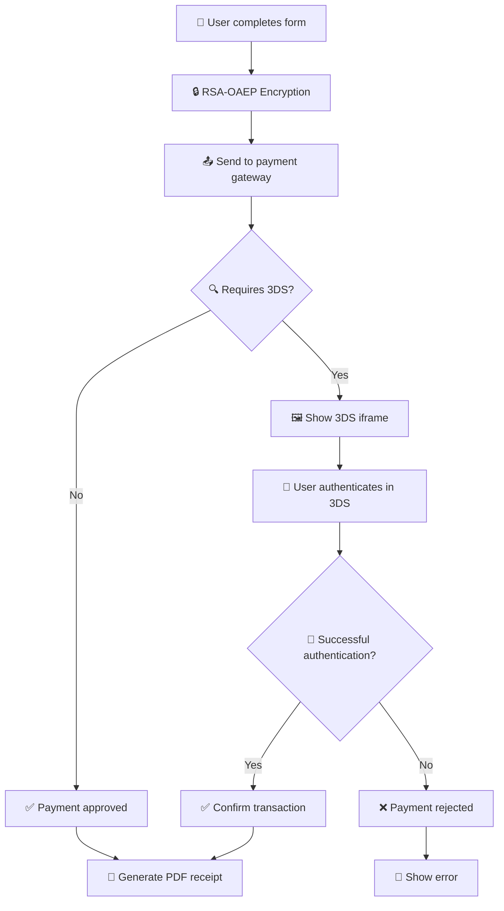
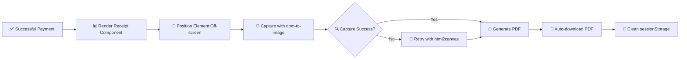

# 🏦 PayEmsula - Payment Platform

[](https://nextjs.org/)
[](https://www.typescriptlang.org/)
[](https://tailwindcss.com/)
[](https://jestjs.io/)

PayEmsula is a modern web application developed with Next.js that allows users to make online payments securely and easily. The application is specifically designed for Emsula customers who want to manage and make payments on their line of credit with advanced features such as automatic PDF receipt generation and 3D Secure authentication.

## 📋 Table of Contents

- [✨ Features](#features)
- [🛠️ Technologies](#technologies)
- [🏗️ Application Architecture](#application-architecture)
- [🔧 Error Handling System](#error-handling-system)
- [⚡ Global Alert System](#global-alert-system)
- [📊 Data Types](#data-types)
- [📁 Project Structure](#project-structure)
- [🧩 Main Components](#main-components)
- [⚙️ Server Functions](#server-functions)
- [🎣 Custom Hooks](#custom-hooks)
- [🔧 Utilities](#utilities)
- [🔐 3DS Authentication Flow](#ds-authentication-flow)
- [📄 PDF Generation System](#pdf-generation-system)
- [🚀 Installation](#installation)
- [📋 Requirements](#requirements)
- [▶️ Running the Application](#running-the-application)
- [🧪 Tests](#tests)
- [👨‍💻 Development](#development)
- [🚀 Deployment](#deployment)
- [⚡ Optimizations and Best Practices](#optimizations-and-best-practices)
- [📜 License](#license)

## ✨ Features

- **🔍 Credit card validation**: Implements the Luhn algorithm to validate card numbers.
- **🎯 Automatic card type detection**: Automatically identifies if it is Visa, Mastercard, American Express, etc.
- **📱 Responsive interface**: Adaptive design for mobile and desktop devices with fluid animations.
- **✅ Validated forms**: Full real-time data validation with visual feedback.
- **👤 Customer information**: Displays a summary of the customer's credit line and contact details.
- **📈 Multi-step payment process**: Payment flow divided into intuitive steps with an animated progress bar.
- **🔐 3DS Integration**: Implementation of Simple Three DS for secure authentication.
- **📄 PDF receipt generation**: Complete system for generating payment receipts in PDF format with a custom design.
- **🎨 Advanced animations**: Interface with smooth animations using Framer Motion for a better user experience.
- **✅ Confirmation system**: Confirmation modals and success/error pages with clear visual feedback.
- **🔒 Data encryption**: Advanced security with RSA-OAEP encryption for sensitive card data.
- **🚨 Global alert system**: Centralized management of notifications with a consistent design and optimized UX.
- **❌ Robust error handling**: Complete system for capturing, structuring, and presenting errors.

## 🛠️ Technologies

| Technology | Version | Description |
|------------|---------|-------------|
|  | **[Next.js 15](https://nextjs.org/)** | React framework with App Router |
|  | **[TypeScript](https://www.typescriptlang.org/)** | Statically typed language |
|  | **[Tailwind CSS](https://tailwindcss.com/)** | Utility-first CSS framework |
|  | **[Radix UI](https://www.radix-ui.com/)** | Accessible UI components |
|  | **[Lucide React](https://lucide.dev/)** | Icon library |
|  | **[Motion](https://motion.dev/)** | Fluid animations and transitions |
|  | **[jsPDF](https://github.com/parallax/jsPDF)** | PDF document generation |
|  | **[node-forge](https://github.com/digitalbazaar/forge)** | RSA-OAEP encryption |
|  | **[Jest](https://jestjs.io/)** | Testing framework |
|  | **Docker** | Containerization |

## Application Architecture

PayEmsula follows a modern Next.js 15 architecture with App Router, implementing a separation of responsibilities pattern:

### Data Flow
1. **Data Capture**: Form components capture and validate user data
2. **Encryption**: Sensitive data is encrypted using RSA-OAEP before being sent to the server
3. **3DS Processing**: Integrates with the payment gateway for 3D Secure authentication
4. **Confirmation**: The transaction is confirmed and PDF receipts are generated automatically

### Design Patterns
- **Custom Hooks**: For reusable logic (usePaymentForm, usePaymentProcess)
- **Server Actions**: For secure server-side operations
- **Component Composition**: Modular and reusable components
- **State Management**: Local state management with React hooks and sessionStorage for persistence

### 🔒 Security
- **🔐 End-to-End Encryption**: Card data encrypted with RSA public keys
- **🎫 JWT Validation**: Tokens with expiration validation and a security margin
- **🧹 Data Sanitization**: Strict validation on the frontend and backend
- **🛡️ 3D Secure**: Additional authentication for transactions

## 🔧 Error Handling System

PayEmsula implements a robust error handling system that ensures a consistent user experience and facilitates debugging during development.

### 🏗️ Error System Architecture

#### ✅ Structured Errors
All API errors follow the `ResTypeError` format:

```typescript
interface ResTypeError {
  title: string;    // Descriptive title of the error
  message: string;  // Detailed message for the user
}
```

#### 🔄 Unified Response Pattern
Server functions return union types that allow handling both successes and errors:

```typescript
// Before: Functions threw exceptions
throw new Error("Something went wrong")

// Now: Functions return union types
return Promise<SuccessType | ResTypeError>
```

### 🛠️ Implementation

#### 📡 Server Functions
- **`postData()`**: Handles payment and 3DS errors
- **`getConfirmations()`**: Manages transaction confirmation errors
- **`getCenterList()`** and **`getCustomerInfo()`**: Handle data query errors

#### 🔍 Error Detection
```typescript
function isErrorResponse(response: unknown): response is ResTypeError {
  return response !== null &&
         typeof response === 'object' &&
         'title' in response &&
         'message' in response;
}
```

#### 🎯 Handling in Components
```typescript
const result = await postData(formData);
if (isErrorResponse(result)) {
  showError(result.title, result.message);
  return;
}
// Continue with success logic
```

### ✅ System Benefits

| Benefit | Description |
|-----------|-------------|
| **🎯 Consistency** | All errors follow the same format |
| **🧪 Testable** | Predictable errors facilitate testing |
| **👤 Improved UX** | Clear and actionable error messages |
| **🐛 Debugging** | Complete error traceability |
| **🔧 Maintainable** | Centralized error handling logic |

## ⚡ Global Alert System

### 🎨 System Features
- **🌍 Global State**: Centralized management with React Context
- **🎭 Multiple Types**: Error, Success, Warning, Information
- **⏰ Auto-close**: Flexible duration configuration
- **⌨️ Accessibility**: Close with ESC key
- **📱 Responsive**: Adaptive design for mobile devices

### 🧩 Components

#### 🎮 AlertProvider
```typescript
// Global context for alerts
<AlertProvider>
  <App />
</AlertProvider>
```

#### 🚨 GlobalAlert
```typescript
// Visual alert component
<GlobalAlert duration={5000} />
```

#### 🎣 useAlert Hook
```typescript
const { showError, showSuccess, showWarning, showInfo } = useAlert();

// Usage in components
showError("Connection error", "Could not connect to the server");
showSuccess("Success!", "Payment processed successfully");
```

### 🎨 Alert Types

| Type | Icon | Color | Usage |
|------|-------|-------|-----|
| **Error** | 🚫 AlertCircle | Red | Critical errors |
| **Success** | ✅ CheckCircle | Green | Successful operations |
| **Warning** | ⚠️ AlertTriangle | Yellow | Warnings |
| **Info** | ℹ️ Info | Blue | General information |

## 📊 Data Types

The application uses TypeScript with well-defined interfaces to ensure type safety:

### 🏗️ Main Interfaces

#### 👤 `DataCardUser`
```typescript
interface DataCardUser {
  mail: string;
  name: string;
  email: string;
  phone: string;
}
```
**Purpose**: Basic user data for the payment form.

#### 💳 `CardData`
```typescript
interface CardData {
  name: string;           // Cardholder's name
  phone: string;          // Contact phone
  cardNumber: string;     // Card number
  expiryDate: string;     // Expiration date (MM/YY)
  cvv: string;           // Security code
  paymentAmount: number;  // Amount to pay
  customerId: number;     // Customer ID
}
```
**Purpose**: Complete card data for payment processing.

#### 🧾 `BillData`
```typescript
interface BillData {
  name: string;           // Customer's name
  amountPaid: number;     // Amount paid
  verification: string;   // Verification code
  lastFourDigits: string; // Last 4 digits of the card
  reference: string;      // Transaction reference
  cardBrand: string;      // Card brand (Visa, MC, etc.)
  phoneNumber: string;    // Customer's phone
}
```
**Purpose**: Data used to generate the customer's PDF receipt.

#### ✅ `ResType`
```typescript
interface ResType {
  authorizationCode: string;      // Authorization code
  transactionIdentifier: string;  // Transaction ID
  totalAmount: number;           // Total amount
  cardBrand: string;             // Card brand
  responseMessage: string;       // Response message
  orderIdentifier: string;       // Order ID
}
```
**Purpose**: Response from the transaction processed by the payment gateway.

#### 🏢 `DataCustomer`
```typescript
type DataCustomer = {
  id: number;              // Unique customer ID
  name: string;            // Full name
  phoneNumber: string;     // Contact phone
  businessName: string;    // Business name
  totalDebt: number;       // Total debt
  creditLimit: number;     // Credit limit
  availableCredit: number; // Available credit
  lastPaymentDate: string; // Last payment date
  paymentStatus: string;   // Payment status
}
```
**Purpose**: Complete customer information and their credit line.

#### 🔐 `ResType3DS`
```typescript
interface ResType3DS {
  requestId: string;    // 3DS request ID
  html: string;        // HTML of the 3DS form
  finalLinks: string[]; // Finalization URLs
}
```
**Purpose**: Response from the 3D Secure system for authentication.

#### ❌ `ResTypeError`
```typescript
interface ResTypeError {
  title: string;    // Descriptive title of the error
  message: string;  // Detailed message to show the user
}
```
**Purpose**: Standard format for all application errors.

## 📁 Project Structure

```
📦 pay-emsula/
├── 📁 src/
│   ├── 📁 app/                    # Next.js App Router
│   │   ├── 📄 layout.tsx          # Main layout with AlertProvider
│   │   ├── 📄 page.tsx            # Home page
│   │   ├── 📁 pago/               # Payment page
│   │   └── 📁 api/                # API Routes
│   │       └── 📁 back/           # Confirmation endpoint
│   ├── 📁 components/             # React components
│   │   ├── 📄 global-alert.tsx    # 🚨 Global alert system
│   │   ├── 📄 payment-form.tsx    # 💳 Main payment form
│   │   ├── 📄 simple-three-ds-modal.tsx # 🔐 3DS authentication modal
│   │   ├── 📁 payment-form/       # Form subcomponents
│   │   │   ├── 📄 personal-info-step.tsx
│   │   │   ├── 📄 card-details-step.tsx
│   │   │   ├── 📄 form-actions.tsx
│   │   │   └── 📄 form-progress.tsx
│   │   └── 📁 ui/                 # Base UI components
│   ├── 📁 hooks/                  # Custom Hooks
│   │   ├── 📄 useAlert.ts         # 🎣 Global alerts hook
│   │   ├── 📄 usePaymentForm.ts   # 🎣 Payment form logic
│   │   └── 📄 usePaymentProcess.ts # 🎣 Payment and 3DS process
│   ├── 📁 providers/              # React Contexts
│   │   └── 📄 alert-provider.tsx  # 🌍 Global alerts provider
│   ├── 📁 server/                 # Server Functions
│   │   ├── 📄 postData.ts         # ⚙️ Data submission functions
│   │   └── 📄 getData.ts          # ⚙️ Data query functions
│   ├── 📁 lib/                    # Utilities
│   │   ├── 📄 card-utils.ts       # 💳 Card validation
│   │   ├── 📄 iframe-utils.ts     # 🖼️ 3DS iframe management
│   │   └── 📄 utils.ts            # 🔧 General utilities
│   ├── 📁 types/                  # TypeScript definitions
│   │   └── 📄 types.ts            # 📊 Interfaces and types
│   └── 📁 __tests__/              # 🧪 Test suite
│       ├── 📁 components/         # Component tests
│       ├── 📁 hooks/              # Hook tests
│       ├── 📁 providers/          # Provider tests
│       ├── 📁 server/             # Server function tests
│       └── 📁 lib/                # Utility tests
├── 📁 public/                     # Static files
│   ├── 🖼️ logo.svg               # Application logo
│   └── 🖼️ *.png/*.jpg            # Product images
├── ⚙️ package.json               # Project dependencies
├── 📝 README-ES.md               # Documentation in Spanish
├── 🐳 Dockerfile                 # Docker configuration
├── ⚡ next.config.ts            # Next.js configuration
├── 🎨 tailwind.config.ts        # Tailwind configuration
├── 🧪 jest.config.ts            # Jest configuration
└── 📘 tsconfig.json             # TypeScript configuration
```

### 📋 Directory Description

| Directory | Purpose | Features |
|------------|-----------|-----------------|
| **📁 `src/app/`** | Next.js App Router | Application routes and layouts |
| **📁 `src/components/`** | React Components | Reusable and specific UI |
| **📁 `src/hooks/`** | Custom Hooks | Reusable React logic |
| **📁 `src/providers/`** | Context Providers | Global application state |
| **📁 `src/server/`** | Server Functions | Server-side logic |
| **📁 `src/lib/`** | Utilities | Helper functions |
| **📁 `src/types/`** | TypeScript Types | Interface definitions |
| **📁 `src/__tests__/`** | Tests | Complete testing suite |

## 🧩 Main Components

### 🎯 Main UI Components

#### 💳 `PaymentForm`
- **Purpose**: Main form for capturing payment data
- **Features**:
  - ✅ Real-time validation
  - 📱 Responsive design
  - 🎨 Fluid animations
  - 📊 Animated progress bar

#### 🔐 `SimpleThreeDSModal`
- **Purpose**: Modal for 3D Secure authentication
- **Features**:
  - 🖼️ Secure iframe for 3DS
  - ⏱️ Timeout handling
  - 🔄 Loading and error states
  - 📱 Responsive design

#### 🚨 `GlobalAlert`
- **Purpose**: Centralized notification system
- **Features**:
  - 🎭 4 alert types (Error, Success, Warning, Info)
  - ⏰ Configurable auto-close
  - ⌨️ Accessibility (ESC to close)
  - 🎨 Consistent design with icons

### 🎮 Form Components

#### 👤 `PersonalInfoStep`
```typescript
// Capture of personal information
- Full name
- Contact phone
- Real-time validation
```

#### 💳 `CardDetailsStep`
```typescript
// Card details
- Card number with automatic type detection
- Expiration date with automatic formatting
- CVV with type-specific validation
- Amount to pay with currency formatting
```

#### 🎯 `FormActions`
```typescript
// Form actions
- Navigation buttons (Previous/Next)
- Payment processing button
- Loading and disabled states
```

#### 📊 `FormProgress`
```typescript
// Progress bar
- Visual indicator of the current step
- Animated transitions between steps
- Clickable navigation between completed steps
```

## ⚙️ Server Functions

### 📤 Submission Functions (`postData.ts`)

#### 🔒 `postData(cardData: CardData)`
```typescript
// Processes payment data with RSA-OAEP encryption
✅ Returns: ResType3DS | ResTypeError
🔐 Encrypts sensitive card data
⚡ Robust error handling
🎯 Validation of structured responses
```

#### 🔑 `getPublicKey()`
```typescript
// Gets public key for encryption
✅ HTTP error handling
🔒 RSA key validation
⚡ Configured timeout
```

### 📥 Query Functions (`getData.ts`)

#### ✅ `getConfirmations(requestId: string)`
```typescript
// Confirms the status of 3DS transactions
✅ Returns: ResType | ResTypeError
🔍 requestId validation
⏱️ Transaction status polling
🎯 Consistent error handling
```

#### 🏢 `getCenterList()`
```typescript
// Lists distribution centers
✅ Returns: CenterList[] | ResTypeError
📋 Results caching
🔍 Filtering and searching
⚡ Network optimization
```

#### 👤 `getCustomerInfo(customerId: number)`
```typescript
// Detailed customer information
✅ Returns: DataCustomer | ResTypeError
🔍 Customer ID validation
💰 Credit and debt data
📊 Payment history
```

## 🎣 Custom Hooks

### 🚨 `useAlert`
```typescript
const { showError, showSuccess, showWarning, showInfo, closeAlert } = useAlert()

// Features:
✅ Shared global state
🎨 Predefined alert types
⏰ Configurable auto-close
🎯 Simple and consistent API
```

### 💳 `usePaymentForm`
```typescript
const {
  formData,
  errors,
  currentStep,
  updateField,
  nextStep,
  prevStep,
  validateStep
} = usePaymentForm()

// Features:
📝 Complete form management
✅ Step-by-step validation
🎯 Navigation between steps
💾 Persistence in sessionStorage
🔄 State synchronization
```

### 💰 `usePaymentProcess`
```typescript
const {
  isWaiting,
  showThreeDS,
  paying,
  htmlResponse,
  startPayment,
  closeModal,
  handleThreeDSSuccess
} = usePaymentProcess()

// Features:
🔐 Full integration with 3DS
⚡ Optimized loading states
❌ Robust error handling
🎯 Complete payment flow
📱 Responsive UX
```

## 🔧 Utilities

### 💳 `card-utils.ts`

#### 🔍 Card Validation
```typescript
// Luhn validation for card numbers
validateCardNumber(cardNumber: string): boolean

// Automatic detection of card type
getCardType(cardNumber: string): 'visa' | 'mastercard' | 'amex' | 'unknown'

// Visual formatting of numbers
formatCardNumber(cardNumber: string): string

// Expiration date validation
validateExpiryDate(expiryDate: string): boolean

// Type-specific CVV validation
validateCVV(cvv: string, cardType: string): boolean
```

### 🖼️ `iframe-utils.ts`

#### 🔐 3DS Handling
```typescript
// Securely loads HTML into an iframe
loadHTMLIntoIframe(iframeId: string, htmlContent: string): void

// Configures an iframe for 3DS
setupSecureIframe(iframe: HTMLIFrameElement): void

// Detects 3DS completion events
listen3DSCompletion(callback: Function): void
```

### 🎨 `animation-variants.ts`

#### ✨ Animation Variants
```typescript
// Enter/exit animations for form steps
export const stepVariants = {
  enter: { opacity: 1, x: 0, transition: { duration: 0.3 } },
  exit: { opacity: 0, x: -20, transition: { duration: 0.2 } },
  initial: { opacity: 0, x: 20 }
}

// Animations for alerts
export const alertVariants = {
  initial: { opacity: 0, y: -50, scale: 0.95 },
  animate: { opacity: 1, y: 0, scale: 1 },
  exit: { opacity: 0, y: -50, scale: 0.95 }
}
```

## 🔐 3DS Authentication Flow

### 🔄 Complete Process



### 🛡️ Implemented Security

| Feature | Implementation | Benefit |
|----------------|----------------|-----------|
| **🔒 RSA-OAEP Encryption** | 2048-bit public key | Protection of sensitive data |
| **🎯 JWT Validation** | Verification with a 2-minute margin | Prevention of expired tokens |
| **🧹 Sanitization** | Strict input validation | Prevention of injections |
| **🔐 3D Secure** | Isolated iframe | Additional authentication |
| **📱 HTTPS** | Valid certificates | Secure communication |

## 📄 PDF Generation System

### 🎨 PDF Features

#### 📋 Receipt Structure
```typescript
✅ Header with company logo and information (Embotelladora De Sula S.A.)
📊 Transaction details grid (Date, Reference, Verification, Card)
💰 Amount paid in Honduran Lempira (L.)
🔢 Unique verification and reference codes
📅 Transaction timestamp
🖊️ Customer name and formatted phone number
💳 Last 4 digits of the card (masked for security)
🎨 Professional design with company branding colors
```

#### 🛠️ Technologies Used
- **jsPDF**: PDF document generation with custom dimensions
- **dom-to-image**: Primary method for HTML-to-image conversion
- **html2canvas**: Fallback method for reliable image capture
- **React**: Component-based receipt structure
- **Tailwind CSS**: Styling and responsive design

#### 🔧 Technical Implementation

**Key Solutions Implemented:**
- **Visibility Management**: Element positioned off-screen but fully rendered for capture
- **Image Optimization**: Standard `` tags instead of Next.js `<Image>` for compatibility
- **Dual Capture Methods**: Primary dom-to-image with html2canvas fallback
- **Custom PDF Dimensions**: 103.19mm x 239.45mm (receipt format)
- **Style Application**: Direct CSS styling for consistent rendering
- **Error Handling**: Comprehensive error catching and user feedback

### 💾 Generation Flow



#### 🐛 Common Issues Solved
- **Blank PDF**: Fixed by ensuring element visibility during capture
- **Image Loading**: Implemented proper image loading verification  
- **CSS Compatibility**: Resolved Tailwind CSS rendering in PDF context
- **Memory Management**: Proper cleanup of generated resources
- **Text Fragmentation**: Solved DOM text splitting in tests using flexible matchers

#### 🧪 Testing Coverage
The PDF generation system includes comprehensive unit tests that cover:
- ✅ Component rendering and data display
- ✅ PDF generation functionality with mocked dependencies
- ✅ SessionStorage cleanup after generation
- ✅ Error handling for failed generations
- ✅ Data formatting (phone numbers, currency, dates)
- ✅ UI state management (button visibility)

## 🚀 Installation

### 📋 Prerequisites

| Tool | Minimum Version | Purpose |
|-------------|----------------|-----------|
| **Node.js** | 18.17.0+ | JavaScript runtime |
| **npm** | 9.0.0+ | Package manager |
| **Git** | 2.34.0+ | Version control |

### ⚡ Quick Installation

```bash
# 1. Clone the repository
git clone https://github.com/your-user/pay-emsula.git
cd pay-emsula

# 2. Install dependencies
npm install

# 3. Configure environment variables
cp .env.example .env.local
# Edit .env.local with your values

# 4. Run in development mode
npm run dev

# 5. Open in browser
# Visit: http://localhost:3000
```

### 🔧 Environment Variables

```bash
# .env.local
API_BASE_URL=https://api.your-server.com
API_KEY=your-secret-api-key
NEXT_PUBLIC_APP_URL=http://localhost:3000
USE_LUHN_VALIDATION=true
```

> **💳 Luhn Validation**: The `USE_LUHN_VALIDATION` variable enables double validation of the Luhn algorithm on the backend. When set to `true`, the server will perform an additional validation of the card number using the Luhn algorithm, providing an extra layer of security in payment processing.

## ▶️ Running the Application

### 🛠️ Available Commands

```bash
# 🚀 Development
npm run dev          # Development server with hot-reload

# 🏗️ Build
npm run build        # Optimized build for production
npm run start        # Production server

# 🧪 Testing
npm test             # Run all tests
npm run test:watch   # Tests in watch mode
npm run test:coverage # Test coverage

# 🔍 Linting and Formatting
npm run lint         # Check code with ESLint
npm run lint:fix     # Automatically fix errors
```

### 🐳 Docker

```bash
# Build image
docker build -t pay-emsula .

# Run container
docker run -p 3000:3000 pay-emsula
```

## 🧪 Tests

### 📊 Test Coverage

| Type | Files | Tests | Coverage |
|------|----------|-------|-----------|
| **🧩 Components** | 5 | 41 | 95%+ |
| **🎣 Hooks** | 2 | 16 | 90%+ |
| **⚙️ Server Functions** | 1 | 8 | 85%+ |
| **🔧 Utilities** | 1 | 12 | 100% |
| **🌍 Providers** | 1 | 7 | 95%+ |
| **📄 Pages** | 1 | 1 | 80%+ |

**📈 Total: 85 tests passing (100%)**

### 🎯 Test Types

#### ✅ Unit Tests
```bash
# Individual components
src/__tests__/components/
├── personal-info-step.test.tsx
├── card-details-step.test.tsx
├── form-actions.test.tsx
├── global-alert.test.tsx
└── customerBill.test.tsx         # 📄 PDF receipt component (13 tests)

# Custom hooks
src/__tests__/hooks/
├── usePaymentForm.test.tsx
└── usePaymentProcess.test.tsx

# Utility functions
src/__tests__/lib/
└── card-utils.test.ts
```

#### 🔗 Integration Tests
```bash
# Server functions
src/__tests__/server/
└── postData.test.ts

# Providers and contexts
src/__tests__/providers/
└── alert-provider.test.tsx
```

#### 🌐 E2E Tests
```bash
# Full pages
src/__tests__/app/
└── page.test.tsx
```

### 🚀 Running Tests

```bash
# All tests
npm test

# Specific tests
npm test -- card-utils.test.ts

# With coverage
npm run test:coverage

# Watch mode
npm run test:watch
```

## 👨‍💻 Development

### 🛠️ Development Environment Setup

#### 📋 Recommended Tools

| Tool | Purpose | Configuration |
|-------------|-----------|---------------|
| **VS Code** | Main editor | ESLint, Prettier, TypeScript extensions |
| **Chrome DevTools** | Debugging | React Developer Tools |
| **Git** | Version control | Pre-commit hooks configured |
| **Postman** | API testing | Endpoint collections |

#### 🔧 VS Code Extensions
```json
{
  "recommendations": [
    "bradlc.vscode-tailwindcss",
    "esbenp.prettier-vscode",
    "dbaeumer.vscode-eslint",
    "ms-vscode.vscode-typescript-next",
    "formulahendry.auto-rename-tag"
  ]
}
```

### 📝 Code Standards

#### 🎨 Style and Formatting
- **Prettier**: Automatic code formatting
- **ESLint**: Linting with strict rules
- **TypeScript**: Mandatory static typing
- **Tailwind CSS**: Utility classes for styles

#### 📂 Naming Conventions
```typescript
// Files
kebab-case.tsx           // Components
camelCase.ts            // Utilities
PascalCase.tsx          // Main components

// Variables and functions
const myVariable = ''    // camelCase
const MyComponent = ()   // PascalCase
const MY_CONSTANT = ''   // UPPER_SNAKE_CASE

// Interfaces and types
interface MyInterface {} // PascalCase with optional 'I'
type MyType = string    // PascalCase
```

#### 🏗️ Component Structure
```typescript
// Recommended template for components
interface ComponentProps {
  // Typed props
}

export function MyComponent({ prop1, prop2 }: ComponentProps) {
  // 1. State hooks
  // 2. Custom hooks
  // 3. Effects
  // 4. Handlers
  // 5. Render
}
```

### 🔄 Git Workflow

```bash
# 1. Create a branch for the feature
git checkout -b feature/new-feature

# 2. Make descriptive commits
git commit -m "feat: add card validation"
git commit -m "fix: correct date format"
git commit -m "docs: update README"

# 3. Run tests before pushing
npm test

# 4. Push and create a Pull Request
git push origin feature/new-feature
```

#### 📋 Commit Types (Conventional Commits)
- **feat**: New feature
- **fix**: Bug fix
- **docs**: Documentation
- **style**: Code formatting
- **refactor**: Refactoring
- **test**: Add/modify tests
- **chore**: Maintenance tasks

## 🚀 Deployment

### 🌐 Deployment Options

#### ⚡ Vercel (Recommended)
```bash
# 1. Install Vercel CLI
npm i -g vercel

# 2. Login and configuration
vercel login
vercel

# 3. Configure environment variables in the dashboard
# 4. Automatic deployment with each push to main
```

#### 🐳 Docker
```dockerfile
# Dockerfile optimized for production
FROM node:18-alpine AS base
WORKDIR /app
COPY package*.json ./
RUN npm ci --only=production

FROM base AS build
RUN npm ci
COPY . .
RUN npm run build

FROM base AS runtime
COPY --from=build /app/.next ./.next
COPY --from=build /app/public ./public
EXPOSE 3000
CMD ["npm", "start"]
```

#### ☁️ AWS/Azure/GCP
```bash
# Example with AWS Amplify
npm install -g @aws-amplify/cli
amplify init
amplify add hosting
amplify publish
```

### 🔧 Production Configuration

#### 🛡️ Production Environment Variables
```bash
# .env.production
NODE_ENV=production
API_BASE_URL=https://api.production.com
API_KEY=secure-production-key
NEXT_PUBLIC_APP_URL=https://pay-emsula.com
USE_LUHN_VALIDATION=true
```

#### ⚡ Optimizations
```javascript
// next.config.ts
const nextConfig = {
  experimental: {
    optimizeCss: true,
    optimizeImages: true,
  },
  compiler: {
    removeConsole: process.env.NODE_ENV === 'production',
  },
  images: {
    domains: ['api.production.com'],
    formats: ['image/webp', 'image/avif'],
  }
}
```

## ⚡ Optimizations and Best Practices

### 🚀 Performance

#### 📦 Bundle Optimization
```javascript
// Lazy loading of heavy components
const HeavyComponent = lazy(() => import('./HeavyComponent'))

// Code splitting by routes
const PaymentPage = lazy(() => import('../pages/PaymentPage'))

// Preloading of critical resources
<link rel="preload" href="/api/public-key" as="fetch" />
```

#### 🖼️ Image Optimization
```jsx
// Next.js Image with automatic optimization
import Image from 'next/image'

<Image
  src="/logo.svg"
  alt="Logo"
  width={200}
  height={100}
  priority={true} // For above-the-fold content
  placeholder="blur"
/>
```

### 🛡️ Security

#### 🔒 Security Headers
```javascript
// next.config.ts
const securityHeaders = [
  {
    key: 'X-DNS-Prefetch-Control',
    value: 'on'
  },
  {
    key: 'Strict-Transport-Security',
    value: 'max-age=63072000; includeSubDomains; preload'
  },
  {
    key: 'X-Frame-Options',
    value: 'SAMEORIGIN'
  },
  {
    key: 'X-Content-Type-Options',
    value: 'nosniff'
  }
]
```

#### 🔍 Data Validation
```typescript
// Strict validation on frontend and backend
const validateCardData = (data: CardData): string[] => {
  const errors: string[] = []

  if (!isValidCardNumber(data.cardNumber)) {
    errors.push('Invalid card number')
  }

  if (!isValidExpiryDate(data.expiryDate)) {
    errors.push('Invalid expiration date')
  }

  return errors
}
```

### 📱 Accessibility

#### ♿ WCAG 2.1 Compliance
```jsx
// Semantic tags and ARIA
<form role="form" aria-labelledby="payment-form-title">
  <h2 id="payment-form-title">Payment Form</h2>

  <input
    aria-describedby="card-number-help"
    aria-invalid={hasError}
    aria-required="true"
  />

  <div id="card-number-help" className="sr-only">
    Enter the 16 digits of your card
  </div>
</form>
```

#### ⌨️ Keyboard Navigation
```typescript
// Key handling for modals
useEffect(() => {
  const handleKeyDown = (event: KeyboardEvent) => {
    if (event.key === 'Escape') {
      closeModal()
    }
    if (event.key === 'Tab') {
      // Trap focus inside the modal
      trapFocus(event)
    }
  }

  document.addEventListener('keydown', handleKeyDown)
  return () => document.removeEventListener('keydown', handleKeyDown)
}, [])
```

### 📊 Monitoring and Analytics

#### 📈 Performance Monitoring
```typescript
// Web Vitals tracking
import { getCLS, getFID, getFCP, getLCP, getTTFB } from 'web-vitals'

getCLS(console.log)
getFID(console.log)
getFCP(console.log)
getLCP(console.log)
getTTFB(console.log)
```

#### 🔍 Error Tracking
```typescript
// Error boundary for error capture
class ErrorBoundary extends React.Component {
  static getDerivedStateFromError(error: Error) {
    return { hasError: true }
  }

  componentDidCatch(error: Error, errorInfo: ErrorInfo) {
    console.error('Error captured:', error, errorInfo)
    // Send to monitoring service (Sentry, LogRocket, etc.)
  }
}
```

## 📜 License

```
MIT License

Copyright (c) 2024 PayEmsula

Permission is hereby granted, free of charge, to any person obtaining a copy
of this software and associated documentation files (the "Software"), to deal
in the Software without restriction, including without limitation the rights
to use, copy, modify, merge, publish, distribute, sublicense, and/or sell
copies of the Software, and to permit persons to whom the Software is
furnished to do so, subject to the following conditions:

The above copyright notice and this permission notice shall be included in all
copies or substantial portions of the Software.

THE SOFTWARE IS PROVIDED "AS IS", WITHOUT WARRANTY OF ANY KIND, EXPRESS OR
IMPLIED, INCLUDING BUT NOT LIMITED TO THE WARRANTIES OF MERCHANTABILITY,
FITNESS FOR A PARTICULAR PURPOSE AND NONINFRINGEMENT. IN NO EVENT SHALL THE
AUTHORS OR COPYRIGHT HOLDERS BE LIABLE FOR ANY CLAIM, DAMAGES OR OTHER
LIABILITY, WHETHER IN AN ACTION OF CONTRACT, TORT OR OTHERWISE, ARISING FROM,
OUT OF OR IN CONNECTION WITH THE SOFTWARE OR THE USE OR OTHER DEALINGS IN THE
SOFTWARE.
```

---

<div align="center">

### 🚀 **PayEmsula - Secure and Modern Payments**

[](https://github.com/your-user/pay-emsula)
[](https://nextjs.org)
[](https://typescriptlang.org)

**[📚 Documentation](README.md) • [🐛 Report Bug](https://github.com/your-user/pay-emsula/issues) • [💡 Request Feature](https://github.com/your-user/pay-emsula/issues)**

</div># paypay
# paypay
# payemsula
